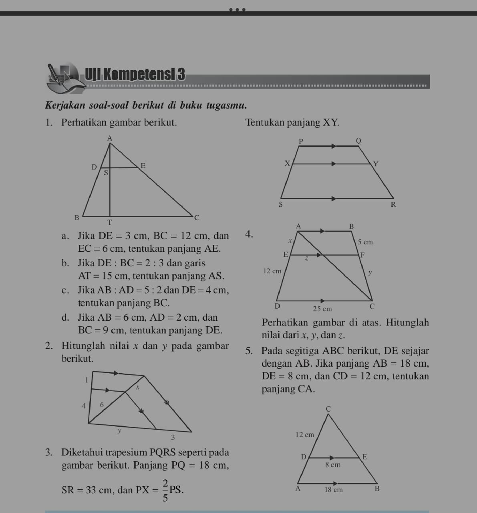
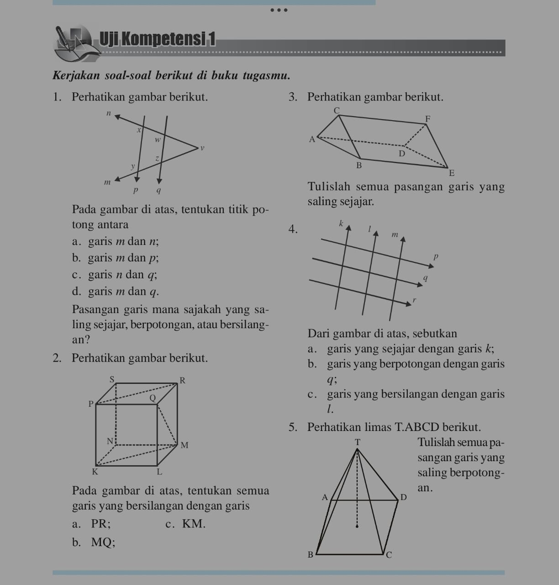

# Bank Soal Bangun Datar

**Persegi**:
1. Sebuah lapangan memiliki bentuk persegi dengan keliling 40 meter. Hitunglah luasnya.
2. Jika luas sebuah persegi adalah 121 m^2, berapakah panjang sisi persegi tersebut?
3. Sebuah gambar berbentuk persegi memiliki keliling 24 cm. Tentukanlah panjang sisi persegi tersebut.
4. Jika luas persegi adalah 64 cm^2, berapakah kelilingnya?
5. Sebuah lapangan berbentuk persegi memiliki luas 400 m^2. Hitunglah kelilingnya.

**Persegi Panjang**:
1. Sebuah lapangan futsal berbentuk persegi panjang memiliki panjang 20 meter dan lebar 15 meter. Hitunglah luasnya.
2. Jika keliling sebuah persegi panjang adalah 34 cm dan panjangnya dua kali lebarnya, berapakah luasnya?
3. Sebuah persegi panjang memiliki luas 72 m^2 dan lebar 6 meter. Tentukanlah panjangnya.
4. Jika luas persegi panjang adalah 90 cm^2 dan panjangnya 15 cm, berapakah lebarnya?
5. Sebuah kolam renang berbentuk persegi panjang memiliki keliling 46 meter. Tentukanlah panjang dan lebarnya.

**Jajar Genjang**:
1. Sebuah jajar genjang memiliki luas 48 cm^2 dan tingginya 8 cm. Berapakah panjang sisi sejajarnya?
2. Jika panjang sisi sejajar jajar genjang adalah 12 cm dan tingginya 10 cm, berapakah luasnya?
3. Sebuah jajar genjang memiliki keliling 32 cm dan salah satu panjang sisi sejajar adalah 10 cm. Hitunglah tingginya.
4. Jika luas jajar genjang adalah 54 cm^2 dan salah satu sisi sejajar memiliki panjang 9 cm, berapakah tingginya?
5. Sebuah jajar genjang memiliki panjang sisi sejajar 15 cm dan tinggi 6 cm. Hitunglah kelilingnya.

**Trapesium**:
1. Sebuah trapesium memiliki keliling 32 cm, dengan panjang sisi sejajar 10 cm dan 8 cm serta tingginya 6 cm. Tentukanlah luasnya.
2. Jika luas trapesium adalah 70 cm^2 dan tingginya 10 cm, berapakah panjang sisi sejajar yang lainnya?
3. Sebuah trapesium memiliki panjang sisi sejajar 12 cm dan 8 cm serta tingginya 5 cm. Hitunglah kelilingnya.
4. Jika keliling trapesium adalah 42 cm dan salah satu sisi sejajar memiliki panjang 10 cm, berapakah tingginya?
5. Sebuah trapesium memiliki luas 96 cm^2 dengan panjang sisi sejajar 12 cm dan tingginya 8 cm. Tentukanlah panjang sisi lainnya.

**Belah Ketupat**:
1. Sebuah belah ketupat memiliki luas 64 cm^2. Jika panjang salah satu diagonalnya adalah 8 cm, berapakah panjang diagonal yang lainnya?
2. Jika keliling belah ketupat adalah 40 cm, berapakah luasnya jika panjang diagonalnya adalah 10 cm?
3. Sebuah belah ketupat memiliki panjang diagonal 15 cm dan diagonal lainnya 12 cm. Hitunglah kelilingnya.
4. Jika luas belah ketupat adalah 100 cm^2 dan panjang diagonalnya 14 cm, berapakah panjang diagonal lainnya?
5. Sebuah belah ketupat memiliki keliling 36 cm dan salah satu diagonalnya 10 cm. Hitunglah luasnya.

**Lingkaran**:
1. Sebuah lingkaran memiliki keliling 31.4 cm. Berapakah luasnya?
2. Jika luas sebuah lingkaran adalah 154 cm^2, berapakah kelilingnya?
3. Sebuah lingkaran memiliki jari-jari 8 cm. Hitunglah kelilingnya.
4. Jika keliling lingkaran adalah 62.8 cm, berapakah jari-jarinya?
5. Sebuah lingkaran memiliki luas 144π cm^2. Tentukanlah kelilingnya.

**Garis dan Sudut**:

