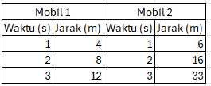

# Soal Latihan PAT Semester Genap
Materi:
- Unsur, Senyawa, Campuran
- Asam, Basa, Garam
- Gerak Lurus

### Unsur, Senyawa, dan Campuran
1. Lengkapilah tabel di bawah ini!

    | No | Jenis Zat | Ciri-ciri | Contoh dalam kehidupan sehari-hari |
    |----|-----------|-----------|------------------------------------|
    | 1  | Unsur     |           |                                    |
    | 2  | Senyawa   |           |                                    |
    | 3  | Campuran  |           |                                    |

2. Sebutkan metode-metode yang digunakan untuk memisahkan campuran dan jelaskan prinsip kerjanya!
3. Jelaskan proses destilasi dan berikan contoh penggunaannya dalam kehidupan sehari-hari!
4. Mengapa air murni dianggap sebagai senyawa, sedangkan air laut dianggap sebagai campuran? Jelaskan!
5. Bagaimana cara memisahkan campuran antara pasir dan garam? Jelaskan langkah-langkahnya!

### Asam Basa Garam
6. Tentukan sifat beberapa bahan di bawah ini berdasarkan hasil identifikasi dengan menggunakan kertas lakmus!

    | Larutan     | Perubahan warna | Sifat larutan |
    |-------------|-----------------|---------------|
    |             | Lakmus merah    | Lakmus biru   |
    | Air sumur   |                 |               |
    | HCl         |                 |               |
    | Air jeruk   |                 |               |
    | NaOH        |                 |               |
    | NH4OH       |                 |               |
    | Glukosa     |                 |               |

7. Jelaskan yang dimaksud dengan reaksi netralisasi! Kemudian sebutkan 2 contoh dalam kehidupan sehari-hari!
8. Jelaskan pengertian asam, basa, dan garam menurut teori Arrhenius!
9. Sebutkan tiga sifat asam dan tiga sifat basa serta berikan contohnya dalam kehidupan sehari-hari!
10. Bagaimana cara menentukan pH suatu larutan? Jelaskan alat dan langkah-langkahnya!

### Gerak Lurus
11. Perhatikan tabel berikut ini!

    | Benda | Jarak I (m) | Waktu I (s) | Jarak II (m) | Waktu II (s) |
    |-------|-------------|-------------|--------------|--------------|
    | I     | 10          | 2           | 20           | 4            |
    | II    | 20          | 4           | 25           | 5            |
    | III   | 30          | 5           | 42           | 7            |
    | IV    | 40          | 8           | 30           | 5            |
    | V     | 55          | 10          | 60           | 6            |

    Tentukan jenis gerak (GLB atau GLBB, jika GLBB diperlambat/dipercepat) pada masing-masing benda!
    - Benda I gerak ...
    - Benda II gerak ...
    - Benda III gerak ...
    - Benda IV gerak ...
    - Benda V gerak ...

12. Perhatikan tabel berikut ini!

    

    Berdasarkan tabel di atas, jawablah pertanyaan di bawah ini:  
    a. Tentukan kecepatan masing-masing mobil tersebut! 
    b. Mobil 1 mengalami gerak ... 
    c. Mobil 2 mengalami gerak ... 
    d. Gambarlah grafik hubungan antara jarak dan waktu untuk gerak kedua mobil tersebut! 

13. Jarak Jakarta ke Bogor adalah 60 km. Sebuah minibus berangkat dari Bogor menuju Jakarta pukul 10.15. Jika minibus itu tiba di Jakarta pukul 11.00, tentukan:
    a. Hitung kecepatan minibus jika kecepatannya tetap.
    b. Gambarlah grafik kecepatan dan perpindahannya!

14. Sebuah mobil yang bergerak dengan kecepatan awal 40 m/s mendapatkan perlambatan 5 m/s². Motor tersebut akan berhenti setelah menempuh jarak sejauh ... m.

15. Sebuah mobil mula-mula diam. Kemudian mobil dihidupkan dan bergerak dengan percepatan tetap 2 m/s². Setelah mobil bergerak selama 10 detik, mesinnya dimatikan. Mobil mengalami perlambatan tetap dan mobil berhenti 10 detik kemudian. Tentukan jarak yang masih ditempuh mobil mulai dari saat mesin dimatikan sampai berhenti!

16. Dua mobil bergerak pada arah yang berlawanan. Mobil pertama bergerak dari titik A ke B dengan kecepatan konstan 50 km/jam, dan mobil kedua dari B ke A dengan kecepatan 70 km/jam. Jika jarak antara A dan B adalah 220 km, maka tentukan:  
a. berapa lama waktu yang dibutuhkan untuk mereka berpapasan?  
b. Di kilometer berapakah (dihitung dari titik A) mereka berpapasan?  v

