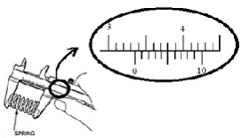

1. Tentukan berapa hasil pengukuran jangka sorong pada percobaan A-E sebagai berikut!

1. Hasil pengukuran diameter bola logam dengan menggunakan mikrometer sekrup adalah 2,75 mm. Gambar yang sesuai dengan hasil pengukuran tersebut adalah…

1. Di bawah ini adalah hasil pengukuran massa sebuah benda menggunakan neraca O’Hauss. Hasil pengukuran massa benda tersebut adalah…
    
    
    
2. Pengukuran panjang pegas dengan jangka sorong dilakukan sebagai berikut:
    
    
    
    Hasil pengukurannya adalah…
    
3. Berikut adalah hasil pengukuran diameter bola kecil menggunakan mikrometer sekrup.
    
    
    
    Hasil pengukurannya adalah…
    
4. Andi melakukan eksperimen menentukan massa jenis 5 cairan berbeda. Berikut hasil eksperimen Andi:
    
    
    | Cairan | Massa (gram) | Volume (ml) |
    | --- | --- | --- |
    | A | 108 | 40 |
    | B | 50 | 45 |
    | C | 80 | 100 |
    | D | 103.4 | 47 |
    | E | 98 | 70 |
    
    Urutkan kelima cairan tersebut dari massa jenis terbesar ke terkecil!
    
5.  Jika suatu benda memiliki massa 500 gram dan massa jenisnya 2 kg/m³, berapa volume benda tersebut?
6. Sebuah balok A dengan panjang 6 cm, lebar 4 cm, dan tinggi 2 cm memiliki massa 240 gram, sedangkan balok B dengan panjang 8 cm, lebar 5 cm, dan tinggi 3 cm memiliki massa 360 gram. Bandingkan massa jenis kedua balok tersebut, dan tentukan balok mana yang lebih padat.
7. Diketahui sebuah bejana logam berbentuk silinder memiliki massa 558 gram. Bejana tersebut memiliki ukuran jari-jari 7cm dan tinggi 10cm. Jika bejana tersebut diisi penuh oleh minyak (massa jenisnya 800 kg/m^3), maka berapa massa totalnya?
8. Diketahui berat Charli dan Andi di Bulan adalah 160N, maka:
    1. Hitunglah massa mereka berdua!
    2. Hitunglah massa Andi jika diketahui Charlie bermassa 55 kg!
    3. Hitung berat mereka masing-masing di Bumi!
9. Rudi adalah seorang astronot bermassa 65 kg. Ia melakukan eksplorasi ke Bulan dan Mars. Maka, tentukan berat Rudi di:
    1. Bumi (g = 10 m/s^2)
    2. Bulan (g = 1.6 m/s^2)
    3. Mars (g = 3.7 m/s^2)
10. Sebuah benda dengan massa 30 kg diketahui memiliki berat 135 N di planet X. Tentukan percepatan gravitasi di planet X!
11.  Konversikan besaran di bawah ini:
    1. 25 km = … dam
    2. 6740 cm = … km
    3. 72 km/jam = … m/s  
    4. 30 m/s = … km/menit = … km/jam  
    5. 2700 kg/m^3 = … gram/cm^3
    6. 5 kg/dm^3 = … mg/cm^3
    7. 15 m/s = … km/jam
    8. 6 m^3 = … centiliter
    9. 25 knot = … km/jam (1 knot = 1.8 km/jam) 
    10. 4 mg/cm^3 = … g/cm^3 = … kg/m^3