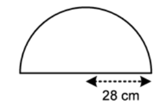
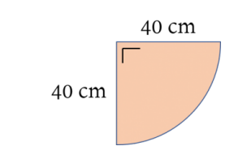
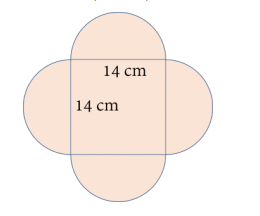
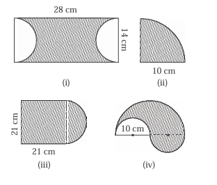

# Soal Latihan Lingkaran
1. Hitunglah keliling lingkaran jika diketahui:
<ol type="a">
  <li>jari-jari 49 m; </li>
  <li>diameter 70 cm;</li>
  <li>jari-jari 21 m;</li>
  <li>diameter 2,8 cm;</li>
  <li>jari-jari 5 cm;</li>
  <li>diameter 15 m;</li>
  <li>jari-jari 3.5 m;</li>
</ol>

2. Sebuah hiasan dibuat berbentuk seperti setengah lingkaran.

Keliling hiasan tersebut adalah...
3. Luas daerah pada bangun datar di bawah adalah · · · · (π = 3, 14)

4. Hitunglah panjang tali yang diperlukan untuk melilitkan sebuah drum berjari-jari 3 cm sebanyak lima putaran.
5. Hitunglah keliling dan luas daerah yang diarsir pada gambar berikut.

6. Hitunglah keliling dan luas daerah yang diarsir pada gambar berikut.

