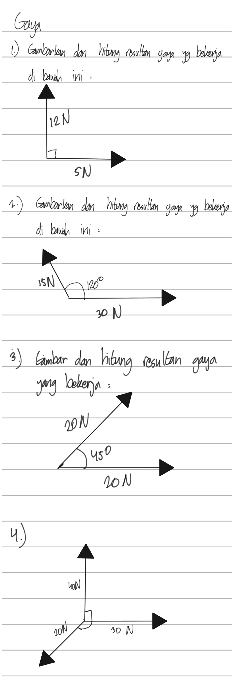

# Soal Latihan PTS Fisika Kelas 8 Semester 1

Materi: Gaya & Usaha dan Energi

## Soal Gaya & Hukum Newton
1. Sebuah Balok ditarik melalui tali oleh dua orang anak dengan gaya masing-masing 55 N dan 35 N. Gambarkan dan hitung resultan gaya dua anak tersebut jika
    1. kedua gaya orang tersebut searah,
    2. kedua gaya orang tersebut berlawanan arah.
2. Evan Mendorong Meja ke arah kanan dengan gaya 20 N, kemudian Thariq datang membantu Evan mendorong dengan gaya 28 N. Dari arah lain, Mega mendorong meja yang sama ke arah kiri dengan gaya sebesar 13 N, kemudian Salsa datang membantu Mega dengan Gaya 15 N. Tentukan resultan dan arah gayanya !!
3.  Kerjakan soal berikut
a.	Berapakah Gaya yang bekerja pada sepeda motor bermassa 200 kg yang dinaiki Bapak Chandra yang bermassa 70 kg dengan percepatan 4 m/s2 ?
b.	Jika Ichwan dengan massa 40 kg membonceng Bapak Chandra ketika berangkat sekolah menggunakan sepeda motor dan percepatan yang sama, berapa Gaya yang bekerja ?
4. Bus Sekolah ESPERO dengan massa 5000 kg bergerak dengan kelajuan 50 m/s, ketika hampir disekolah, Bus tersebut direm dengan gaya 12500 N, berapakah JARAK yang ditempuh Bus ESPERO mulai direm sampai berhenti ?
5. Tuliskan Bunyi Hukum Newton I dan berikan 2 (dua) contoh peristiwa yang berkaitan dengan Hukum Newton I !
6.  Berdasarkan perhitungan yang dilakukan astronout, gaya gravitasi dipermukaan BULAN seperlima kali gaya gravitasi BUMI, Jika diketahui massa Astronout 60 Kg, dan percepatan Gravitasi bumi 10 m/s2. Berapakah BERAT Astronout di BUMI dan BULAN ?
7. Sebuah balok ditarik oleh dua orang anak dengan gaya masing-masing 60 N dan 40 N. Gambarkan dan hitung resultan gaya dua anak tersebut jika:
    a. Kedua gaya tersebut searah.
    b. Kedua gaya tersebut berlawanan arah.
8. Iqbal mendorong sebuah lemari dengan gaya 35 N ke arah kanan. Dari arah yang berlawanan, Fadli mendorong dengan gaya 45 N. Sementara itu, Farah membantu Iqbal dengan mendorong ke arah yang sama sebesar 20 N.
    a. Tentukan resultan gaya yang bekerja pada lemari tersebut.
    b. Jelaskan arah pergerakan lemari berdasarkan resultan gaya tersebut. 
9. Sebuah sepeda motor bermassa 150 kg ditarik oleh sebuah tali dengan gaya konstan sehingga mengalami percepatan sebesar 3 m/s²
    1. Berapa besar gaya yang diperlukan untuk memberikan percepatan tersebut?
    2. Jika sepeda motor tersebut dinaiki oleh seorang pengendara yang memiliki massa 50 kg, berapa besar gaya total yang bekerja pada sistem motor-pengendara?
    3. Jika sistem pada pertanyaan (b) ditambah 1 penumpang tambahan dengan massa 40 kg, berapa besar gaya total yang bekerja pada sistem motor-pengendara-penumpang?
10. Sebuah mobil dengan massa 1000 kg bergerak dengan kecepatan awal 72 km/jam. Saat menghindari tabrakan, pengemudi mengerem mobil dengan gaya sebesar 8000 N.
    a. Berapakah percepatan negatif (perlambatan) yang dialami mobil tersebut?
    b. Berapa jarak yang diperlukan mobil untuk berhenti total?
11. Sebuah kotak bermassa 20 kg didorong di atas lantai datar dengan gaya 50 N ke arah kanan. Jika gesekan yang terjadi antara benda dan lantai dianggap 200N, hitung percepatan yang dialami kotak tersebut. (g = 10 m/s²)

## Soal Usaha & Energi

1. Sebuah kotak bermassa 5 kg didorong sejauh 4 meter dengan gaya konstan sebesar 30 N yang sejajar dengan lantai. Berapakah usaha yang dilakukan pada kotak tersebut? Apa pengaruh gaya gesekan jika ada?
2. Sebuah mobil bermassa 1200 kg bergerak dengan kecepatan 10 m/s di atas jalan datar. Hitunglah energi kinetik mobil tersebut dan jelaskan hubungan antara energi kinetik dengan usaha yang diperlukan untuk menghentikan mobil!
3. Benda dengan massa 10 kg jatuh dari ketinggian 20 meter. Hitunglah energi potensial benda pada ketinggian 10 meter dan tentukan energi mekanik totalnya selama jatuh!
4. Sebuah balok bermassa 8 kg ditarik sejauh 15 meter pada bidang miring licin dengan gaya sebesar 50 N yang membentuk sudut 30° terhadap horizontal. Berapakah usaha yang dilakukan oleh gaya tersebut?
5. Sebuah benda bergerak dengan kecepatan awal 5 m/s dan mengalami percepatan sebesar 2 m/s² selama 5 detik. Hitunglah usaha total yang dilakukan pada benda tersebut selama percepatan ini!
6. Sebuah bola dilempar ke atas dengan energi kinetik awal sebesar 100 J. Berapakah ketinggian maksimum yang dicapai bola jika massa bola 2 kg? Asumsikan percepatan gravitasi 10 m/s².
7. Dalam suatu percobaan, sebuah pegas dengan konstanta pegas 200 N/m diregangkan sejauh 0,5 meter. Berapakah energi potensial elastik yang tersimpan dalam pegas tersebut?
8. Sebuah gerobak bermassa 50 kg ditarik dengan gaya sebesar 150 N sehingga gerobak bergerak dengan percepatan 2 m/s² selama 10 meter. Tentukan usaha yang dilakukan gaya pada gerobak tersebut serta energi kinetiknya pada akhir lintasan!
9. Sebuah benda bermassa 20 kg ditarik sejauh 10 meter dengan gaya sebesar 100 N pada sudut 45° terhadap lantai kasar. Hitunglah usaha yang dilakukan oleh gaya tersebut dan bagaimana gaya gesekan mempengaruhi usaha total!
10. Jelaskan bagaimana usaha yang dilakukan oleh gaya luar dapat mempengaruhi energi kinetik dan energi potensial suatu benda! Berikan contoh konkret berdasarkan hukum kekekalan energi mekanik.
11. Sebuah benda bermassa 3 kg jatuh dari ketinggian 10 meter dan berhenti ketika mengenai permukaan. Tentukan usaha yang dilakukan oleh gaya gravitasi selama benda jatuh serta hitung kecepatan benda tepat sebelum menyentuh tanah.
12. Sebuah mobil bermassa 1000 kg mempercepat dari 0 hingga 30 m/s dalam jarak 200 meter. Tentukan gaya yang bekerja pada mobil tersebut dan hitung usaha yang dilakukan oleh mesin mobil.
13. Sebuah benda bermassa 15 kg mengalami percepatan sebesar 3 m/s² ketika ditarik oleh gaya 60 N. Berapakah jarak yang ditempuh benda setelah 5 detik? Hubungkan perhitungan ini dengan konsep usaha dan energi mekanik.
14. Dua benda, masing-masing bermassa 2 kg dan 3 kg, jatuh dari ketinggian 10 meter. Tentukan perbandingan energi potensial dan energi kinetik kedua benda tepat sebelum menyentuh tanah.
15. Sebuah bola bermassa 0,5 kg dilempar horizontal dengan kecepatan awal 10 m/s. Setelah menempuh jarak 50 meter, kecepatan bola berkurang menjadi 5 m/s. Berapakah usaha yang dilakukan oleh gaya gesekan selama lintasan ini?