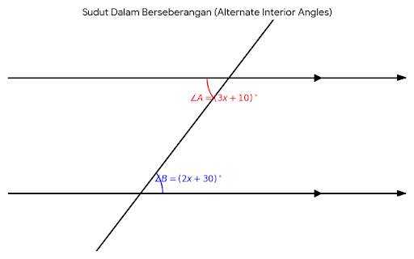

# Latihan Soal TKA Matematika SMP (Kelas 7-9)

## I. Soal Pilihan Ganda (40 Soal)
1. Hasil dari operasi $-12 + 20 \times 4 - (-6) : 2$ adalah ....

    A. 71

    B. 65

    C. 42

    D. 36

2. Diketahui pecahan $0,65$; $\frac{5}{8}$; $0,7$; dan $69\%$. Urutan pecahan dari yang terkecil ke yang terbesar adalah ....

    A. $\frac{5}{8}$; $0,65$; $69\%$; $0,7$

    B. $0,65$; $69\%$; $\frac{5}{8}$; $0,7$

    C. $\frac{5}{8}$; $0,65$; $0,7$; $69\%$

    D. $69\%$; $0,65$; $0,7$; $\frac{5}{8}$

3. Dalam kompetisi Matematika, setiap jawaban benar diberi skor 4, salah diberi skor -2, dan tidak dijawab diberi skor -1. Dari 40 soal yang diberikan, Rina berhasil menjawab benar 30 soal dan salah 6 soal. Skor total yang diperoleh Rina adalah ....

    A. 114

    B. 110

    C. 108

    D. 104

4. Sebuah proyek pembangunan gedung diperkirakan selesai dalam waktu 60 hari jika dikerjakan oleh 24 pekerja. Setelah 15 hari bekerja, proyek terhenti selama 9 hari karena kehabisan bahan bangunan. Agar proyek selesai tepat waktu, berapa banyak pekerja tambahan yang diperlukan?

    A. 4 orang

    B. 6 orang

    C. 8 orang

    D. 10 orang

5. Hasil dari $\sqrt{72} + \sqrt{50} \times \sqrt{288} - \sqrt{200}$ adalah ....

    A. $4\sqrt{2} + 120$

    B. $120 - 4\sqrt{2}$

    C. $60 + 4\sqrt{2}$

    D. $120 + 2\sqrt{2}$

6. Perhatikan barisan bilangan berikut: $2, 5, 10, 17, \dots$. Suku ke-15 dari barisan tersebut adalah ....

    A. 224

    B. 226

    C. 255

    D. 257

7. Dalam sebuah gedung pertunjukan, baris paling depan terdapat 15 kursi, baris di belakangnya selalu tersedia 4 kursi lebih banyak dari baris di depannya. Jika terdapat 20 baris kursi, maka jumlah seluruh kursi di gedung tersebut adalah ....

    A. 960 kursi

    B. 1.060 kursi

    C. 1.140 kursi

    D. 1.200 kursi

8. Pak Budi menabung uang di bank sebesar Rp4.000.000,00 dengan bunga tunggal 8% per tahun. Setelah beberapa bulan, jumlah tabungan Pak Budi menjadi Rp4.240.000,00. Lama Pak Budi menabung adalah ....

    A. 6 bulan

    B. 8 bulan

    C. 9 bulan

    D. 10 bulan

9. Bentuk sederhana dari $4(2x - 5y) - 5(x + 3y)$ adalah ....

    A. $3x - 2y$

    B. $3x - 17y$

    C. $3x - 35y$

    D. $13x - 5y$

10. Penyelesaian dari persamaan $\frac{2}{3}(x - 4) = \frac{1}{2}(x + 6)$ adalah ....

    A. $x = 18$

    B. $x = 24$

    C. $x = 34$

    D. $x = 38$

11. Dari 40 siswa di kelas IX A, terdapat 25 siswa gemar Matematika, 20 siswa gemar IPA, dan 7 siswa tidak gemar keduanya. Banyak siswa yang gemar Matematika dan IPA adalah ....

    A. 8 siswa

    B. 10 siswa

    C. 12 siswa

    D. 15 siswa

12. Diketahui fungsi $f(x) = ax + b$. Jika $f(2) = 1$ dan $f(5) = 10$, maka nilai dari $f(-3)$ adalah ....

    A. -14

    B. -10

    C. 7

    D. 12

13. Gradien garis yang melalui titik $A(-2, 5)$ dan $B(4, -7)$ adalah ....

    A. -2

    B. -$\frac{1}{2}$

    C. $\frac{1}{2}$

    D. 2

14. Persamaan garis yang melalui titik $(3, -2)$ dan tegak lurus terhadap garis $4x - 2y + 8 = 0$ adalah ....

    A. $x + 2y + 1 = 0$

    B. $x - 2y - 7 = 0$

    C. $2x + y - 4 = 0$

    D. $2x - y - 8 = 0$

15. Harga 3 buku tulis dan 2 pensil adalah Rp14.500,00. Sedangkan harga 2 buku tulis dan 3 pensil adalah Rp13.000,00. Harga 5 buku tulis dan 1 pensil adalah ....

    A. Rp18.500,00

    B. Rp19.000,00

    C. Rp20.500,00

    D. Rp21.000,00

16. Perhatikan gambar dua garis sejajar yang dipotong oleh garis transversal. Jika besar $\angle A = (3x + 10)^\circ$ dan $\angle B = (2x + 30)^\circ$ adalah sudut dalam berseberangan, maka besar $\angle B$ adalah ....

    A. $20^\circ$

    B. $50^\circ$

    C. $70^\circ$

    D. $110^\circ$

17. Diketahui segitiga dengan panjang sisi $(x + 2)$ cm, $(2x + 1)$ cm, dan $(3x - 4)$ cm. Jika keliling segitiga tersebut 35 cm, maka panjang sisi terpendek adalah ....

    A. 6 cm

    B. 8 cm

    C. 13 cm

    D. 14 cm

18. Sebuah kapal berlayar dari pelabuhan A ke arah utara sejauh 45 km, kemudian berbelok ke arah timur sejauh 60 km menuju pelabuhan B. Jarak terpendek dari pelabuhan A ke pelabuhan B adalah ....

    A. 75 km

    B. 85 km

    C. 90 km

    D. 105 km

19. Pada sebuah lingkaran berpusat di O, terdapat titik A, B, dan C pada keliling lingkaran. Jika besar $\angle AOB = 80^\circ$, maka besar $\angle ACB$ adalah ....

    A. $20^\circ$

    B. $40^\circ$

    C. $80^\circ$

    D. $160^\circ$

20. Diketahui panjang jari-jari sebuah lingkaran adalah 21 cm. Jika besar sudut pusat juring adalah $60^\circ$, maka panjang busur lingkaran tersebut adalah ....
Persamaan garis yang melalui titik $(3, -2)$ dan tegak lurus terhadap garis $4x - 2y + 8 = 0$ adalah ....

    A. $x + 2y + 1 = 0$

    B. $x - 2y - 7 = 0$

    C. $2x + y - 4 = 0$

    D. $2x - y - 8 = 0$

21. Harga 3 buku tulis dan 2 pensil adalah Rp14.500,00. Sedangkan harga 2 buku tulis dan 3 pensil adalah Rp13.000,00. Harga 5 buku tulis dan 1 pensil adalah ....

    A. Rp18.500,00

    B. Rp19.000,00

    C. Rp20.500,00

    D. Rp21.000,00

22. Perhatikan gambar dua garis sejajar yang dipotong oleh garis transversal. Jika besar $\angle A = (3x + 10)^\circ$ dan $\angle B = (2x + 30)^\circ$ adalah sudut dalam berseberangan, maka besar $\angle B$ adalah ....

    

    A. $20^\circ$

    B. $50^\circ$

    C. $70^\circ$

    D. $110^\circ$

23. Diketahui segitiga dengan panjang sisi $(x + 2)$ cm, $(2x + 1)$ cm, dan $(3x - 4)$ cm. Jika keliling segitiga tersebut 35 cm, maka panjang sisi terpendek adalah ....

    A. 6 cm

    B. 8 cm

    C. 13 cm

    D. 14 cm

24. Sebuah kapal berlayar dari pelabuhan A ke arah utara sejauh 45 km, kemudian berbelok ke arah timur sejauh 60 km menuju pelabuhan B. Jarak terpendek dari pelabuhan A ke pelabuhan B adalah ....

    A. 75 km

    B. 85 km

    C. 90 km

    D. 105 km

25. Pada sebuah lingkaran berpusat di O, terdapat titik A, B, dan C pada keliling lingkaran. Jika besar $\angle AOB = 80^\circ$, maka besar $\angle ACB$ adalah ....

    A. $20^\circ$

    B. $40^\circ$

    C. $80^\circ$

    D. $160^\circ$

26. Pada sebuah lingkaran berpusat di O, terdapat titik A, B, dan C pada keliling lingkaran. Jika besar $\angle AOB = 80^\circ$, maka besar $\angle ACB$ adalah ....

    A. $20^\circ$

    B. $40^\circ$

    C. $80^\circ$

    D. $160^\circ$

27. Panjang Busur dan Luas Juring
Diketahui panjang jari-jari sebuah lingkaran adalah 21 cm. Jika besar sudut pusat juring adalah $60^\circ$, maka panjang busur lingkaran tersebut adalah .... ($\pi = \frac{22}{7}$)

    A. 11 cm

    B. 22 cm

    C. 33 cm

    D. 44 cm

28. Garis Singgung Persekutuan
Dua lingkaran masing-masing berjari-jari 14 cm dan 2 cm. Jika jarak antara kedua pusat lingkaran adalah 20 cm, maka panjang garis singgung persekutuan luarnya adalah ....

    A. 12 cm

    B. 15 cm

    C. 16 cm

    D. 18 cm

29. Bangun Ruang Sisi Datar (Prisma)
Sebuah prisma alasnya berbentuk belah ketupat dengan panjang diagonal 16 cm dan 12 cm. Jika tinggi prisma 15 cm, maka luas permukaan prisma tersebut adalah ....

    A. 792 cm²

    B. 864 cm²

    C. 924 cm²

    D. 996 cm²

30. Bangun Ruang Sisi Lengkung (Kerucut)
Sebuah kerucut memiliki volume $300\pi$ cm³. Jika jari-jari alas kerucut 10 cm, maka tinggi kerucut tersebut adalah ....

    A. 3 cm

    B. 9 cm

    C. 12 cm

    D. 15 cm

31. Kesebangunan (Foto dan Karton)
Sebuah foto berukuran $30 \text{ cm} \times 40 \text{ cm}$ ditempelkan pada selembar karton. Di sebelah kiri, kanan, dan atas foto masih tersisa karton selebar 3 cm. Jika foto dan karton sebangun, lebar karton di bagian bawah foto adalah ....

    A. 3 cm

    B. 4 cm

    C. 5 cm

    D. 6 cm

32. Kesebangunan (Pohon dan Bayangan)
Seorang anak yang tingginya 150 cm memiliki bayangan sepanjang 2 m. Pada saat yang sama, bayangan sebuah tiang bendera adalah 12 m. Tinggi tiang bendera sebenarnya adalah ....

    A. 6 m

    B. 8 m

    C. 9 m

    D. 10 m

33. Statistika (Mean Gabungan)
Rata-rata nilai ulangan matematika dari 30 siswa adalah 75. Jika nilai 2 siswa baru digabungkan, rata-ratanya menjadi 76. Rata-rata nilai kedua siswa baru tersebut adalah ....

    A. 86

    B. 88

    C. 91

    D. 92

34. Perhatikan data berikut: $6, 7, 8, 6, 9, 8, 7, 6, 10, 5$.
Median dan modus data tersebut berturut-turut adalah ....

    A. 7 dan 6

    B. 7 dan 7

    C. 6,5 dan 6

    D. 6 dan 7

35. Kotak A berisi 3 bola merah, 4 bola biru, dan 5 bola hijau. Jika diambil satu bola secara acak, peluang terambilnya bola merah dari kotak A adalah ....

    A. $\frac{1}{4}$

    B. $\frac{1}{3}$

    C. $\frac{5}{12}$

    D. $\frac{7}{12}$

36. Dalam melempar 2 buah dadu bersamaan, peluang muncul mata dadu kembar (1 dan 1, 2 dan 2, dst) adalah ....
    
    A. 0,3

    B. 0,6

    C. $\frac{1}{6}$

    D. $\frac{1}{3}$

37. Persamaan Kuadrat
Akar-akar dari persamaan kuadrat $2x^2 + 5x - 12 = 0$ adalah ....

    A. -4 dan $\frac{3}{2}$

    B. 4 dan $-\frac{3}{2}$

    C. -3 dan 2

    D. 3 dan -2

38. Fungsi Kuadrat (Titik Puncak)
Koordinat titik balik (puncak) dari grafik fungsi $f(x) = x^2 - 6x + 8$ adalah ....

    A. $(3, -1)$

    B. $(3, 1)$

    C. $(-3, -1)$

    D. $(-3, 1)$

39. Sebuah benda berbentuk tabung yang ditutup dengan setengah bola pada salah satu ujungnya. Jika diameter tabung 14 cm dan tinggi tabung 10 cm, maka volume bangun gabungan tersebut adalah .... ($\pi = \frac{22}{7}$)

    A. 2.156 cm³

    B. 2.258 cm³

    C. 2.512 cm³

    D. 2.926 cm³

40. Sudut Pusat dan Sudut Keliling
Perhatikan lingkaran O. Titik A, B, C, D berada pada lingkaran sehingga terbentuk segiempat tali busur ABCD. Jika $\angle ABC = 100^\circ$, maka besar $\angle ADC$ adalah ....

    A. $80^\circ$

    B. $90^\circ$

    C. $100^\circ$

    D. $120^\circ$

41. Hasil dari $(-2)^5 + (-2)^4 + (-2)^3 + (-2)^0$ adalah ....

    A. -24

    B. -23

    C. -8

    D. 23

42. Bentuk sederhana dari $\frac{2x^2 - 5x - 12}{4x^2 - 9}$ adalah ....

    A. $\frac{x - 4}{2x - 3}$

    B. $\frac{x + 4}{2x + 3}$

    C. $\frac{x - 4}{2x + 3}$

    D. $\frac{x + 4}{2x - 3}$

43. Diketahui pola bilangan sebagai berikut: 1, 3, 6, 10, ....
Banyak noktah (titik) pada pola ke-12 adalah ....

    A. 66

    B. 72

    C. 78

    D. 91

44. Logika Matematika TKA
Di sebuah toko, harga 1 kg apel sama dengan harga 2 kg jeruk. Ibu membeli 3 kg apel dan 4 kg jeruk dengan harga Rp100.000,00. Jika Ibu ingin membeli 2 kg apel dan 3 kg jeruk, uang yang harus dibayarkan adalah ....

    A. Rp60.000,00

    B. Rp65.000,00

    C. Rp70.000,00

    D. Rp75.000,00

45. Statistik Deskriptif (Interpretasi Data)
Nilai rata-rata sekelompok siswa perempuan adalah 78 dan kelompok siswa laki-laki adalah 70. Jika rata-rata kelas tersebut adalah 75 dan banyak siswa laki-laki adalah 12 orang, maka banyak siswa perempuan adalah ....

    A. 15 orang

    B. 18 orang

    C. 20 orang

    D. 24 orang

## II. Soal Essay (10 Soal)

46. Di tempat parkir sebuah pusat perbelanjaan terdapat 50 kendaraan yang terdiri dari mobil dan sepeda motor. Jumlah roda seluruhnya adalah 140 buah (mobil beroda 4, motor beroda 2). Jika tarif parkir mobil Rp5.000,00 dan motor Rp2.000,00, hitunglah total pendapatan tukang parkir saat itu!

47. Sebuah taman berbentuk persegi panjang dengan ukuran $20 \text{ m} \times 14 \text{ m}$. Di tengah taman terdapat kolam berbentuk lingkaran dengan diameter 14 m. Area di luar kolam akan ditanami rumput. Hitunglah luas lahan yang ditanami rumput!

48. Rata-rata berat badan 8 orang adalah 55 kg. Jika berat badan Andi dan Budi dimasukkan, rata-ratanya menjadi 56 kg. Jika berat badan Andi 5 kg lebih berat dari Budi, tentukan berat badan Andi dan Budi masing-masing!

49. Tentukan persamaan garis yang melalui titik potong antara garis $2x + y = 8$ dan garis $x - 3y = -3$, serta sejajar dengan garis yang melalui titik $(2,1)$ dan $(5,7)$!

50. Sebuah bak mandi berbentuk balok berukuran $120 \text{ cm} \times 80 \text{ cm} \times 60 \text{ cm}$ akan diisi air hingga penuh. Air mengalir dari kran dengan debit 12 liter/menit.

    a. Berapa liter volume bak mandi tersebut?
    b. Berapa waktu yang dibutuhkan untuk mengisi bak mandi hingga penuh?

51. Diketahui trapesium ABCD dengan AB sejajar CD. Panjang $AB = 25 \text{ cm}$ dan $CD = 10 \text{ cm}$. Titik E terletak pada kaki AD dan titik F pada kaki BC sehingga EF sejajar AB. Jika $AE : ED = 2 : 3$, hitunglah panjang EF!

52. Seutas tali dipotong menjadi 5 bagian sehingga panjang potongan-potongannya membentuk barisan geometri. Jika panjang potongan terpendek adalah 4 cm dan potongan terpanjang adalah 324 cm, tentukan panjang tali mula-mula!

53. Dua buah dadu dilempar bersamaan. Tentukan peluang munculnya:

    a. Mata dadu berjumlah prima.
    b. Mata dadu kembar (sama).

54. Tinggi h meter dari sebuah roket air setelah t detik ditembakkan vertikal ke atas dirumuskan dengan $h(t) = 40t - 5t^2$.

    a. Tentukan tinggi maksimum yang dapat dicapai roket tersebut.
    b. Tentukan waktu yang dibutuhkan roket untuk mencapai tanah kembali.

55. Seorang pedagang membeli 2 kuintal beras dengan harga Rp2.000.000,00. Beras tersebut dijual eceran dengan dua kemasan. Kemasan 1 kg dijual Rp11.000,00 dan kemasan 2 kg dijual Rp21.000,00. Jika pedagang tersebut ingin mendapatkan keuntungan minimal 15%, tentukan salah satu kombinasi penjualan yang mungkin (berapa bungkus kemasan 1 kg dan 2 kg) jika semua beras habis terjual!
