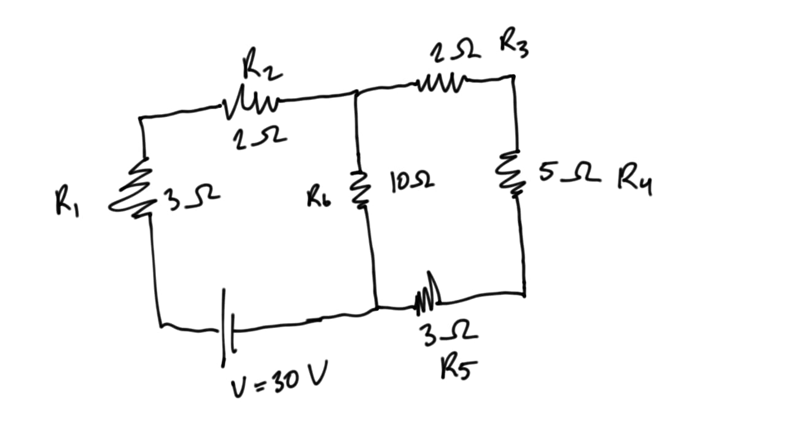
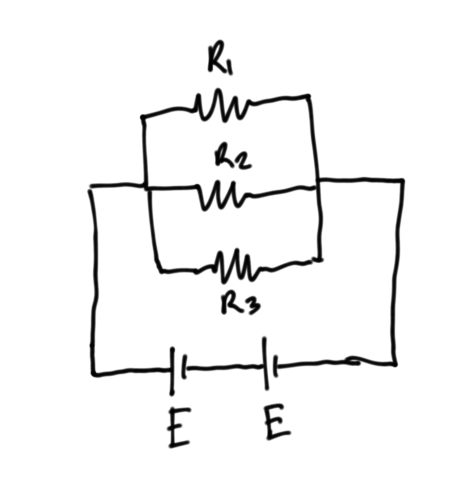
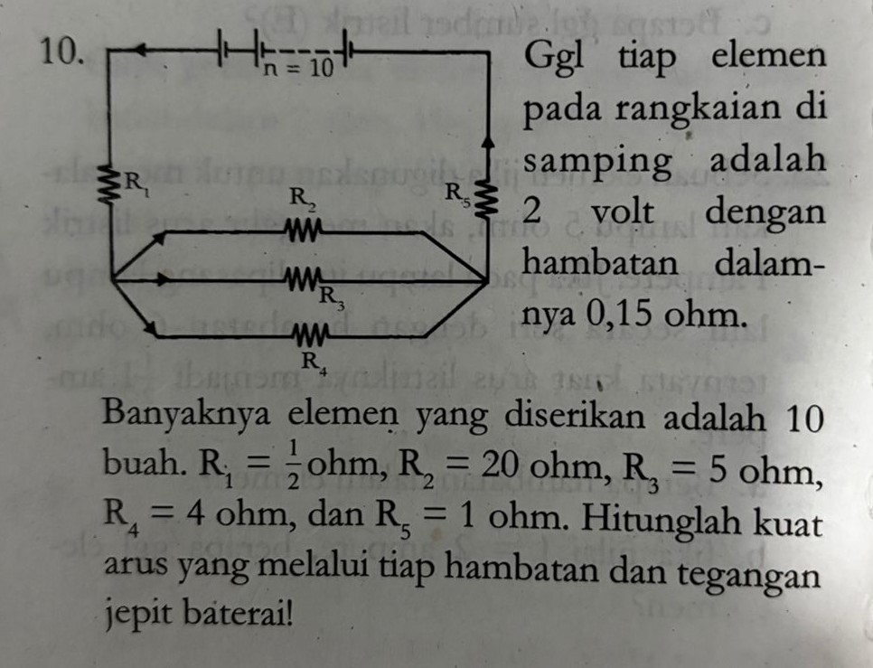
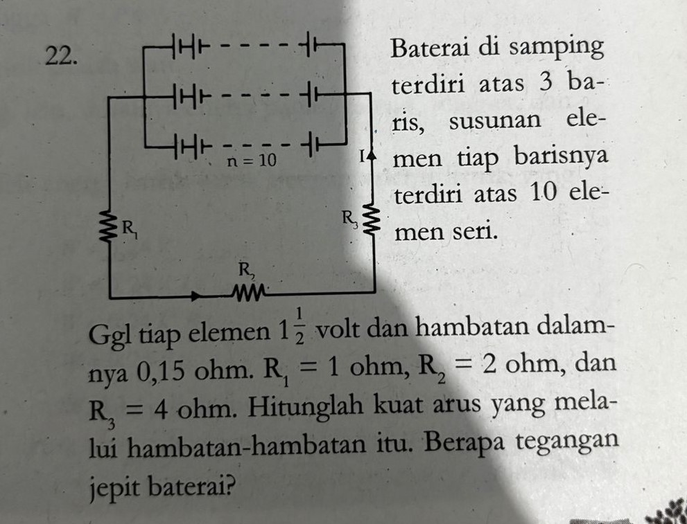

# Soal PAT Fisika Kelas 9 Semester 1

Materi: Cermin dan Lensa, Alat Optik, Listrik Statis, Listrik Dinamis

---

### **Bagian 1: Cermin dan Lensa (10 Soal)**

1.  Sebuah benda setinggi 4 cm diletakkan 15 cm di depan cermin cekung yang memiliki jari-jari kelengkungan 20 cm. Hitunglah jarak bayangan dan tinggi bayangan yang terbentuk!
2.  Benda diletakkan di depan cermin cembung sejauh 10 cm. Jika jarak fokus cermin adalah 15 cm, tentukan jarak bayangan dan perbesarannya! (Ingat: fokus cermin cembung bernilai negatif).
3.  Sebuah benda berada 12 cm di depan cermin cekung dengan fokus 6 cm. Jika benda digeser 3 cm mendekati cermin, tentukan perubahan sifat bayangan dari posisi awal ke posisi akhir!
4.  Sebuah paku diletakkan di depan lensa cembung dan menghasilkan bayangan nyata dengan perbesaran 2 kali. Jika jarak fokus lensa 10 cm, berapakah jarak benda tersebut dari lensa?
5.  Lensa cekung memiliki kekuatan -2 Dioptri. Jika sebuah benda diletakkan 25 cm di depan lensa tersebut, di manakah letak bayangannya?
6.  Dua buah lensa, satu cembung ($f = 20$ cm) dan satu cekung ($f = -10$ cm) disusun berdekatan pada satu sumbu utama. Jika benda diletakkan 40 cm di depan lensa cembung (lensa pertama), dan jarak antar lensa diabaikan, berapakah jarak bayangan akhir yang terbentuk oleh sistem lensa gabungan tersebut?
7.  Sebuah lilin menyala berada 30 cm di depan lensa cembung. Bayangan yang terbentuk ditangkap oleh layar yang berada 60 cm di belakang lensa. Tentukan kekuatan lensa tersebut dalam satuan Dioptri!
8.  Sebuah benda diletakkan di depan cermin cekung menghasilkan bayangan nyata diperbesar 3 kali. Jika benda digeser 5 cm menjauhi cermin, bayangannya menjadi nyata diperbesar 2 kali. Tentukan jarak fokus cermin tersebut!
9.  Tinggi benda 2 cm diletakkan di depan lensa cembung yang berjarak fokus 5 cm. Jika jarak benda 4 cm, hitunglah tinggi bayangan dan sebutkan sifatnya!
10. Sebuah cermin cembung digunakan sebagai kaca spion mobil. Sebuah truk berada 20 meter di belakang mobil tersebut. Jika jari-jari kelengkungan spion 4 meter, berapa jarak bayangan truk di dalam spion?

---

### **Bagian 2: Alat Optik (10 Soal)**

11. Seseorang hanya mampu melihat benda dengan jelas paling jauh pada jarak 2 meter. Berapa kekuatan lensa kacamata yang harus ia gunakan agar dapat melihat seperti mata normal?
12. Seorang penderita hipermetropi memiliki titik dekat (PP) 50 cm. Ia ingin membaca koran pada jarak normal (25 cm). Berapa kekuatan lensa kacamata yang diperlukan?
13. Budi memakai kacamata berkekuatan -1,5 Dioptri. Karena matanya bertambah minus, ia mengganti kacamata menjadi -2 Dioptri. Berapa pergeseran titik jauh (Punctum Remotum) mata Budi?
14. Ayah menggunakan kacamata +2 Dioptri. Jika ia melepas kacamatanya, pada jarak berapakah benda paling dekat yang masih bisa dilihat dengan jelas oleh Ayah?
15. Seseorang yang bercacat mata miopi tidak mampu melihat dengan jelas benda yang teletak pada jarak lebih dari 50 cm. Berapa kekuatan lensa kacamata yang harus ia gunakan agar dapat melihat seperti mata normal?
16. Sebuah mikroskop memiliki lensa objektif dengan fokus 2 cm dan lensa okuler dengan fokus 5 cm. Sebuah preparat diletakkan 2,2 cm di bawah lensa objektif. Hitung perbesaran total mikroskop untuk mata berakomodasi maksimum! (Sn = 25 cm).
17. Menggunakan data soal no. 16, hitunglah perbesaran total jika pengamatan dilakukan dengan mata **tidak berakomodasi**.
18. Sebuah mikroskop menghasilkan perbesaran total 50 kali saat mata tidak berakomodasi. Jika perbesaran lensa okuler adalah 10 kali dan jarak fokus objektifnya 4 mm, tentukan jarak benda ke lensa objektif!
19. Panjang tubus mikroskop (jarak antar lensa) adalah 14 cm. Jika fokus okuler 5 cm dan bayangan objektif jatuh tepat pada fokus okuler (pengamatan tak berakomodasi), dan fokus objektif 1 cm, tentukan jarak benda ke lensa objektif!
20. Seseorang menggunakan lup (kaca pembesar) dengan kekuatan 20 Dioptri. Tentukan perbesaran anguler lup jika mata berakomodasi maksimum (Sn = 25 cm).
21. Seorang siswa mengamati benda kecil menggunakan lup. Saat mata rileks (tak berakomodasi), perbesarannya 4 kali. Berapa perbesarannya jika ia ingin mengamati dengan mata berakomodasi pada jarak 25 cm?

---

### **Bagian 3: Listrik Statis (10 Soal)**

22. Dua muatan titik masing-masing $+4 \mu C$ dan $+9 \mu C$ terpisah sejauh 30 cm. Berapakah besar gaya tolak-menolak kedua muatan tersebut? ($k = 9 \times 10^9 \text{ Nm}^2/\text{C}^2$).
23. Dua muatan identik terpisah sejauh $r$ menghasilkan gaya $F$. Jika jarak kedua muatan diubah menjadi $\frac{1}{2}r$, berapa besar gaya tolak-menolaknya sekarang dinyatakan dalam $F$?
24. Titik A berada pada jarak 3 cm dari muatan $+2 \mu C$. Hitunglah kuat medan listrik pada titik A!
25. Dua muatan $Q_A = +4 \mu C$ dan $Q_B = +9 \mu C$ terpisah sejauh 20 cm. Di manakah letak titik C (diukur dari A) agar kuat medan listrik di titik C sama dengan nol?
26. Diperlukan usaha sebesar 40 Joule untuk memindahkan muatan sebesar 2 Coulomb dari titik A ke titik B. Berapakah beda potensial antara titik A dan B?
27. Dua buah bola logam identik A dan B masing-masing bermuatan $+10 \text{ C}$ dan $-2 \text{ C}$. Keduanya disentuhkan sesaat kemudian dipisahkan kembali. Berapakah muatan masing-masing bola setelah dipisahkan?
28. Gaya Coulomb antara dua muatan A dan B adalah 16 N. Jika muatan A diperbesar 2 kali dan muatan B diperbesar 3 kali, sedangkan jaraknya dijauhkan menjadi 2 kali semula, berapakah gaya Coulomb yang baru?
29. Sebuah benda bermassa 20 gram dan bermuatan $0,5 \mu C$ melayang diam dalam medan listrik homogen. Tentukan besar dan arah medan listrik tersebut! ($g = 10 \text{ m/s}^2$).
30. Potensial listrik sejauh 4 cm dari suatu muatan titik $q$ sama dengan 10 V. Berapakah potensial listrik sejauh 8 cm dari muatan tersebut?
31. Tiga muatan listrik disusun dalam satu garis lurus: A ($+q$), B ($-2q$), dan C ($+2q$). Jarak AB = BC = $r$. Tentukan resultan gaya yang dialami oleh muatan B!

---

### **Bagian 4: Listrik Dinamis (10 Soal)**

32. Tiga buah hambatan masing-masing $2 \Omega$, $3 \Omega$, dan $6 \Omega$ dirangkai secara paralel. Kemudian rangkaian tersebut diserikan dengan hambatan $4 \Omega$. Gambarkan rangkaian tersebut dan hitunglah hambatan pengganti totalnya!
33. Jika rangkaian pada soal no. 32 dihubungkan dengan tegangan 10 Volt, berapakah kuat arus total yang mengalir?
34. Perhatikan gambar rangkaian berikut:

Tentukan:

    a. Hambatan total rangkaian
    b. Kuat arus yang mengalir
    c. Tegangan yang dialami R1 dan R2
    d. Apakah tegangan yang dialami pada hambatan 2 Ohm (R2 dan R3) sama? Jika tidak sama, jelaskan mengapa?
    e. Apakah kuat arus yang dialami pada hambatan 2 Ohm (R2 dan R3) sama? Jika tidak sama, jelaskan mengapa?
    f. Kuat arus yang dialami hambatan R6

35. Perhatikan gambar rangkaian berikut:

Diketahui 2 sumber energi E dengan masing-masing memiliki tegangan 12V dan hambatan dalam 1 Ohm. Jika rangkaian tersebut dihubungkan dengan 3 hambatan dengan R1 = 12 Ohm, R2 = 18 Ohm, dan R3 = 36 Ohm yang dihubungkan paralel, tentukan:

    a. Hambatan total rangkaian
    b. Tegangan jepit rangkaian
    c. Kuat arus yang mengalir di rangkaian
    d. Kuat arus yang mengalir di setiap hambatan R1, R2, dan R3

36. Sebuah rumah menggunakan 4 lampu 20 Watt (menyala 10 jam/hari), 1 TV 100 Watt (5 jam/hari), dan 1 Kulkas 150 Watt (24 jam/hari). Hitunglah total energi listrik yang digunakan dalam 1 bulan (30 hari) dalam satuan kWh!
37. Melanjutkan soal no. 35, jika tarif listrik per kWh adalah Rp 1.500,00, berapakah biaya listrik yang harus dibayar?
38. Perhatikan rangkaian satu loop: Sumber tegangan 12V dan 6V dipasang berlawanan arah. Terdapat tiga resistor seri: $2 \Omega$, $3 \Omega$, dan $1 \Omega$. Hitunglah kuat arus yang mengalir pada rangkaian dan tegangan yang dialami setiap resistor!
39. 5 buah lampu identik dirangkai. Lampu A dan B seri. Lampu C, D, E paralel satu sama lain. Kemudian kelompok (A-B) diparalelkan dengan kelompok (C-D-E). Jika satu lampu putus, analisis apa yang terjadi pada nyala lampu lainnya (Konseptual hitungan: perbandingan arus). *Untuk latihan ini, hitung perbandingan Hambatan Total jalur atas (A-B) dengan jalur bawah (C-D-E).*
40. Sebuah teko listrik bertuliskan 220 V / 500 W. Jika teko tersebut dipasang pada tegangan 110 V, berapakah daya yang dihasilkan teko tersebut sekarang?
41. Sebuah baterai memiliki GGL (Gaya Gerak Listrik) 9 Volt dan hambatan dalam 1 Ohm. Baterai tersebut dihubungkan dengan lampu berhambatan 3,5 Ohm. Berapakah tegangan jepit baterai tersebut?
42. Jawab pertanyaan berikut:
 

42. Jawab pertanyaan berikut:
 